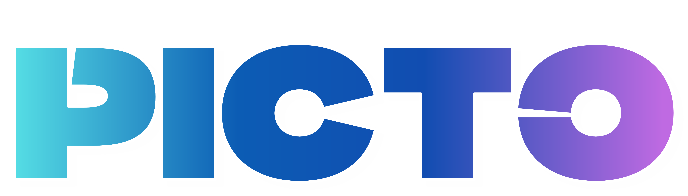

# 🎨 Picto - AI-Powered Online Photo Editor

> **Next.js, Convex, 그리고 AI를 활용한 실시간 웹 이미지 에디터 서비스**

 
*(프로젝트 배너나 실행 화면 GIF가 있다면 여기에 넣어주세요)*

**[🚀 배포 링크 바로가기 (Live Demo)](https://picto-image-editing.vercel.app)**

## 📖 프로젝트 소개 (Introduction)
**Picto**는 누구나 쉽고 빠르게 이미지를 편집할 수 있는 SaaS 기반 웹 에디터입니다.
단순한 자르기/회전 기능을 넘어, **Generative AI**를 활용한 배경 제거, 이미지 확장(Outpainting), 객체 제거 기능을 제공합니다. 별도의 설치 없이 웹에서 즉시 실행되며, 모든 작업 내역은 클라우드에 실시간으로 저장됩니다.

## 🛠️ 기술 스택 (Tech Stack)

### Frontend
- **Framework:** Next.js 15 (App Router)
- **Language:** JavaScript / TypeScript
- **Styling:** Tailwind CSS, Shadcn UI
- **Canvas Engine:** Fabric.js v6
- **State Management:** React Context API, Zustand

### Backend & Database
- **BaaS (Backend-as-a-Service):** Convex (Real-time DB & Functions)
- **Authentication:** Clerk
- **Storage & AI Processing:** ImageKit

### Tools & Deployment
- **Deployment:** Vercel
- **Internationalization:** next-intl (English/Korean)

---

## 💡 기술적 의사결정 (Technical Decisions)

### 1. Convex: 끊김 없는(Seamless) 편집 경험을 위한 실시간 동기화
이미지 에디터의 핵심은 사용자의 작업(이동, 리사이징, 필터 등)이 지연 없이 즉각적으로 화면에 반영되는 것입니다.
* **Why Convex?** REST API를 폴링(Polling)하거나 WebSocket 서버를 직접 구축하는 오버헤드 없이, Convex의 **구독(Subscription)** 모델을 활용하여 데이터 변경 사항을 UI에 실시간으로 동기화했습니다.
* **Optimistic Updates:** 사용자가 편집 버튼을 누르는 즉시 반응하도록 하여, 네트워크 대기 시간을 느끼지 못하는 쾌적한 사용성을 구현했습니다.

### 2. Next.js (App Router): SEO와 초기 로딩 최적화
웹 기반 서비스로서 검색 엔진 유입(Organic Traffic)과 초기 이탈 방지가 중요했습니다.
* **SSR (Server Side Rendering):** 마케팅 페이지와 대시보드에 SSR을 적용하여 검색 엔진 최적화(SEO)를 강화했습니다.
* **Hybrid Rendering:** 상호작용이 많은 에디터 캔버스 부분은 `'use client'`를 명시하여 브라우저 리소스를 효율적으로 활용하고, 정적인 부분은 서버 컴포넌트로 처리하여 **TTV(Time To View)**를 단축했습니다.

---

## 🔥 기술적 챌린지 (Technical Challenges)

### 🎨 캔버스 상태 관리: React(선언형)와 Fabric.js(명령형)의 동기화
React의 상태 관리 패러다임과 HTML5 Canvas를 직접 조작하는 Fabric.js 간의 '싱크(Sync)'를 맞추는 것이 가장 큰 과제였습니다.

**1. Context API 기반의 브리지(Bridge) 구축**
* `useCanvas` 커스텀 훅을 통해 Canvas 인스턴스를 전역에서 관리하며, 툴바 컴포넌트들이 캔버스 객체에 접근할 수 있도록 제어권을 중앙화했습니다.
* **반응형 뷰포트(Responsive Viewport):** `Zoom`과 `Scale`을 동적으로 계산하여, 디바이스 화면 크기에 상관없이 원본 이미지의 고해상도 좌표계를 유지하며 편집할 수 있도록 구현했습니다.

**2. 자동 저장 최적화 (Debouncing)**
* **문제:** 객체를 드래그할 때마다 발생하는 수백 번의 `object:modified` 이벤트가 DB에 과도한 쓰기 요청을 유발했습니다.
* **해결:** `setTimeout`을 활용한 **2초 디바운싱(Debouncing)** 로직을 구현하여, 사용자의 조작이 멈춘 뒤에만 상태를 저장함으로써 네트워크 비용을 획기적으로 절감했습니다.

---

## 📂 폴더 구조 (Folder Structure)

```bash
├── app
│   ├── [locale]          # 다국어(i18n) 지원을 위한 라우트 (en/ko)
│   │   ├── (auth)        # 로그인/회원가입 (Clerk)
│   │   ├── (main)        # 메인 어플리케이션 (Dashboard, Editor)
│   │   └── api           # Next.js API Routes (ImageKit 업로드 등)
├── convex                # Convex 백엔드 함수 (DB Schema, Queries, Mutations)
├── components
│   ├── ui                # 재사용 가능한 UI 컴포넌트 (Button, Slider 등)
│   └── ...               # 기능별 컴포넌트 (Editor, Dashboard)
├── hooks                 # 커스텀 훅 (useCanvas, useConvexQuery 등)
├── messages              # 다국어 번역 JSON 파일
└── public                # 정적 리소스 (Images, Icons)
```
---

## 🚀 실행 방법 (Getting Started)

이 프로젝트는 로컬 환경에서 실행하기 위해 **Convex**와 **Next.js**가 모두 실행되어야 합니다.

**1. 저장소 클론 (Clone Repository)**

```bash
git clone [https://github.com/your-username/picto.git](https://github.com/your-username/picto.git)
cd picto

```

**2. 패키지 설치 (Install Dependencies)**

```bash
npm install

```

**3. 환경 변수 설정 (Environment Variables)**
루트 디렉토리에 `.env.local` 파일을 생성하고 다음 키값들을 입력해주세요.

```env
# Convex
CONVEX_DEPLOYMENT=generated_by_npx_convex_dev
NEXT_PUBLIC_CONVEX_URL=your_convex_url

# Clerk (Authentication)
NEXT_PUBLIC_CLERK_PUBLISHABLE_KEY=your_clerk_key
CLERK_SECRET_KEY=your_clerk_secret

# ImageKit (AI & Storage)
NEXT_PUBLIC_IMAGEKIT_PUBLIC_KEY=your_imagekit_public_key
NEXT_PUBLIC_IMAGEKIT_URL_ENDPOINT=your_imagekit_url_endpoint
IMAGEKIT_PRIVATE_KEY=your_imagekit_private_key

```

**4. 백엔드 실행 (Run Convex)**
별도의 터미널에서 실행하여 백엔드 함수를 동기화합니다.

```bash
npx convex dev

```

**5. 프론트엔드 실행 (Run Next.js)**

```bash
npm run dev

```

브라우저에서 `http://localhost:3000`으로 접속하여 확인하세요!

```

